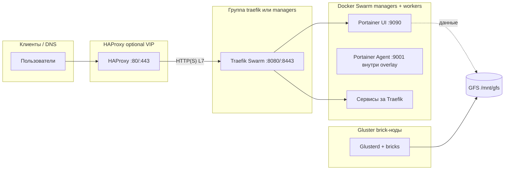

# Docker Swarm + GlusterFS + Traefik + HAProxy + Portainer

Коротко: этот репозиторий с Ansible‑ролями поднимает кластер из 5 Docker Swarm‑узлов с:

- **L7‑роутингом** (Traefik)
- **Web‑UI управления** (Portainer)
- **Распределённым хранилищем** (GlusterFS)
- **Внешним балансировщиком** (HAProxy + VIP)

## Что используется

- **Docker / Docker Swarm**: оркестрация контейнеров.
- **Portainer**: Web‑UI для Swarm (`http://portainer.docker.local` по умолчанию).
- **HAProxy**: балансировщик между Traefik‑узлами и точка входа в кластер.
- **Prometheus + Grafana**: мониторинг Swarm‑кластера.

Полезно почитать:  
`https://www.portainer.io/blog/monitoring-a-swarm-cluster-with-prometheus-and-grafana`  
Шаблоны приложений Portainer: `https://github.com/portainer/templates/tree/v3`

## Схема трафика и порты

Вход пользователей — **HAProxy** (часто с **keepalived VIP**), дальше HTTP(S) уходит на **Traefik** на хостовых портах `traefik_http_port` / `traefik_https_port`. Traefik маршрутизирует L7 в сервисы **Docker Swarm** (в т.ч. Portainer). Общие данные — **GlusterFS**, смонтированный в `gluster_mount_path` (по умолчанию `/mnt/gfs`).



Порты ниже — **дефолты из ролей** (`haproxy`, `traefik`, `portainer`, `cluster-defaults` для SSH); в inventory их можно переопределить.

| Порт | Протокол | Где / назначение |
|------|-----------|------------------|
| 80 | TCP | HAProxy HTTP; на том же порту URI `/stats` (статистика HAProxy) |
| 443 | TCP | HAProxy HTTPS |
| 8080 | TCP | Traefik entry **web** (сюда смотрит HAProxy по HTTP) |
| 8443 | TCP | Traefik entry **websecure** |
| 9090 | TCP | Portainer Web UI (published) |
| 9082 | TCP | Traefik dashboard/API (published) и internal entrypoint |
| 22 | TCP | SSH (`default_ssh_port` в cluster-defaults; учитывается firewall при lockdown) |
| 9001 | TCP | Portainer Agent (в overlay UI ↔ агенты; не обязательно с интернета) |
| 8000 | TCP | Portainer — tunnel port (published на хосте) |
| 2377 | TCP | Docker Swarm — join manager/worker к лидеру |
| 7946 | TCP, UDP | Swarm node discovery (gossip) |
| 4789 | UDP | Swarm overlay (VXLAN) |
| 24007 | TCP | Gluster — `glusterd` |
| 49152+ | TCP | Gluster — порты brick’ов (диапазон) |

При **`firewall_lockdown=true`** роль `firewall-iptables` открывает «публичный» TCP‑набор из портов HAProxy и опубликованных портов Traefik (те же имена переменных, что в стеках: обычно 80, 443 и 8080, 8443; совпадающие номера схлопываются). Остальное (Swarm, Gluster, SSH) — по правилам lockdown и inventory.

Если **`firewall_lockdown=false`**, по отдельным шаблонам роли `firewall-iptables` в **INPUT** вешаются цепочки **`SWARM-NODE-PORTS`** (`apply-swarm-ports-restrict.sh.j2`), **`PORTAINER-NODE-PORTS`** (`apply-portainer-ports-restrict.sh.j2`), **`GLUSTER-NODE-PORTS`** (`apply-gluster-ports-restrict.sh.j2`). С интернета режутся **Swarm** (**2377/TCP**, **7946/TCP+UDP**, **4789/UDP**, флаг **`firewall_restrict_swarm_ports`**), **Portainer** (**8000/TCP**, **9001/TCP**, **`firewall_restrict_portainer_service_ports`**) и **Gluster** (по умолчанию **24007/TCP** и диапазон **49152–49664/TCP** для brick-портов — списки **`firewall_restrict_gluster_tcp_dports`** и **`firewall_restrict_gluster_tcp_dport_ranges`**, флаг **`firewall_restrict_gluster_service_ports`**). Для нод кластера и `firewall_trusted_admin_cidrs` доступ сохраняется. **9090** (Web UI Portainer) не трогается. Выключить по отдельности: `firewall_restrict_swarm_ports=false`, `firewall_restrict_portainer_service_ports=false`, `firewall_restrict_gluster_service_ports=false`.

### Как применить ограничения без lockdown (все три сервиса и диапазоны Gluster)

**1. Переменные** — в **`[all:vars]`** инвентори (например `inventory.ini`) или в `group_vars`. Дефолты роли `firewall-iptables` уже включают `firewall_restrict_* = true`; при необходимости задайте явно и переопределите Gluster:

```ini
firewall_lockdown=false

firewall_restrict_swarm_ports=true
firewall_restrict_portainer_service_ports=true
firewall_restrict_gluster_service_ports=true

firewall_restrict_gluster_tcp_dports=[24007]
firewall_restrict_gluster_tcp_dport_ranges=['49152:49664']
```

Сложные списки удобнее вынести в **`group_vars/all.yml`** (YAML):

```yaml
firewall_restrict_swarm_ports: true
firewall_restrict_portainer_service_ports: true
firewall_restrict_gluster_service_ports: true
firewall_restrict_gluster_tcp_dports: [24007]
firewall_restrict_gluster_tcp_dport_ranges:
  - '49152:49664'
```

Несколько диапазонов brick-портов (каждый элемент — строка **`начало:конец`**, как в iptables):

```yaml
firewall_restrict_gluster_tcp_dport_ranges:
  - '49152:49200'
  - '60000:60100'
```

**2. Запуск** — правила ставит только роль **`firewall-iptables`**; стадию нельзя пропускать (`--skip-tags firewall-iptables` в отладочном цикле как раз её отключает).

Только firewall на нодах из плейбука (`swarm_managers`, `swarm_workers`, `gluster_nodes`):

```bash
ANSIBLE_CONFIG="$PWD/ansible.cfg" ansible-playbook -i inventory.ini playbooks/plays/11-firewall-iptables.yml -u root --private-key ~/.ssh/id_ed25519
```

Полная установка **вместе** с firewall (без `--skip-tags firewall-iptables`):

```bash
ANSIBLE_CONFIG="$PWD/ansible.cfg" ansible-playbook -i inventory.ini playbooks/install.yml -u root --private-key ~/.ssh/id_ed25519
```

На целевых хостах создаются цепочки **`SWARM-NODE-PORTS`**, **`PORTAINER-NODE-PORTS`**, **`GLUSTER-NODE-PORTS`** (если соответствующие флаги `true`), выполняется **`netfilter-persistent save`**. Один прогон роли при **`firewall_lockdown=false`** делает общую подготовку (whitelist нод и `firewall_trusted_admin_cidrs`), затем по очереди три скрипта и одно сохранение правил.

| Переменная | Назначение |
|------------|------------|
| `firewall_restrict_swarm_ports` | Шаблон `apply-swarm-ports-restrict.sh.j2` |
| `firewall_restrict_portainer_service_ports` | Шаблон `apply-portainer-ports-restrict.sh.j2` |
| `firewall_restrict_gluster_service_ports` | Шаблон `apply-gluster-ports-restrict.sh.j2` |
| `firewall_restrict_gluster_tcp_dports` | Дискретные TCP Gluster (например **24007**) |
| `firewall_restrict_gluster_tcp_dport_ranges` | Диапазоны TCP для brick-портов (`start:end`) |

Пустой список доверенных CIDR в **INI** лучше не задавать как `firewall_trusted_admin_cidrs=[]` (часто приходит **строка** `[]`, из‑за чего ломается нормализация). Либо **удалите** ключ, либо используйте `group_vars` в YAML, либо оставьте пустое значение без скобок — роль приводит `[]` / пустую строку к пустому списку.

Если при стадии `firewall-iptables` в логе **FileNotFoundError: No usable temporary directory** или обёртка **MODULE FAILURE** / **Broken pipe** при задаче **apt** — часто переполнен **`/`** (или нет прав на временные каталоги): большой ansiballz модуля `apt` не может создать каталог в `/tmp` / под `~/.ansible`. Роль создаёт **`/tmp`**, **`/var/tmp`** и выставляет **`ansible_remote_tmp`** на **`/run/ansible-remote-tmp`** (tmpfs). Если ошибка остаётся, проверьте **`df -h`**, **`df -i`**, **`mount`**, **`TMPDIR`** на хосте.

## Минимальные требования

- **5 хостов** c Debian/Ubuntu (1 для HAProxy, 3 для Swarm, 1 для Traefik).
- Доступ по SSH (один пользователь с `sudo` без пароля).
- На Swarm‑нодах:
  - 2 CPU, 4 ГБ RAM, диск 30 ГБ+ для ОС
  - Дополнительный диск 10 ГБ+ под GlusterFS
- Рабочая машина с установленным **Ansible**.

## Быстрый запуск

1. **Установить Ansible** (пример для Ubuntu):

   ```bash
   sudo apt update
   sudo apt install -y ansible python3-venv python3-pip
   ```

2. **Клонировать репозиторий и создать venv**:

   ```bash
   git config --global user.email "x-shura@mail.ru"
   git config --global user.name "Aleksandr Saglaev"

   git clone https://github.com/.../docker-swarm-ansible.git
   cd docker-swarm-ansible

   python3 -m venv .venv
   source .venv/bin/activate
   pip install -U pip
   pip install -r requirements.txt
   ```

3. **Настроить инвентори** в файлах:

   - `inventory.ini` – список хостов и группы (`[haproxy]`, `[swarm_managers]`, `[swarm_workers]`, `[gluster_nodes]`)
   - `playbooks/roles/cluster-defaults/defaults/main.yml` – порты, пакеты Docker, учётки Portainer/Traefik/HAProxy; inventory и defaults остальных ролей их дополняют или перекрывают

   Минимум нужно:

   - 1 хост в `[haproxy]`
   - 3 хоста в `[swarm_managers]`

4. **Проверить доступ по SSH** и работу Ansible:

   ```bash
   ### Test Connectivity to Hosts
   ssh-keygen -t rsa -b 4096 -C "$(whoami)@$(uname -n)-$(date -I)" -f ~/.ssh/id_rsa
   ssh-keygen -t ed25519 -b 4096 -C "$(whoami)@$(uname -n)-$(date -I)" -f ~/.ssh/id_ed25519
   eval "$(ssh-agent -s)"
   ssh-add ~/.ssh/id_rsa

   ssh-copy-id -i ~/.ssh/id_rsa.pub $(whoami)@192.168.1.ХХ

   ansible all -i inventory.ini -m ping
   ```

5. **Запустить плейбук установки** — см. ниже **«Деплой и проверка (рабочий цикл)»**. Кратко, без venv и лога:

   ```bash
   ANSIBLE_CONFIG="$PWD/ansible.cfg" ansible-playbook -i inventory.ini playbooks/install.yml -u root --private-key ~/.ssh/id_ed25519
   ```

   Если Ansible **игнорирует `ansible.cfg`** (часто каталог на `/mnt/c/...` в WSL — world-writable), задайте **`ANSIBLE_CONFIG="$PWD/ansible.cfg"`** (отдельного флага у `ansible-playbook` для этого нет).  
   (`--private-key` и `--key-file` — одно и то же.)

### Деплой и проверка (рабочий цикл)

Рекомендуемый порядок из корня клона:

1. **Перед запуском деплоя** — виртуальное окружение и зависимости:

   ```bash
   python3 -m venv .venv
   source .venv/bin/activate
   pip install -U pip
   pip install -r requirements.txt
   ```

2. **Деплой с подробным логом** в файл в каталоге проекта. В этом цикле **firewall не применяем** (ни роль iptables, ни смысл `firewall_lockdown` на хостах) — используйте **`--skip-tags firewall-iptables`**:

   ```bash
   ANSIBLE_STDOUT_CALLBACK=yaml ANSIBLE_CONFIG="$PWD/ansible.cfg" ansible-playbook -i inventory.ini playbooks/install.yml -u root --private-key ~/.ssh/id_ed25519 --skip-tags firewall-iptables -vvv 2>&1 | tee deploy-$(date +%Y%m%d-%H%M).log
   ```

3. **Проверка** — открыть созданный `deploy-ГГГГММДД-ЧЧММ.log` и искать `FAILED`, `fatal:`, `ERROR!`.

4. **Повторять** шаги 1–3, пока в логе не останется ошибок (при необходимости обновить зависимости, инвентори или правки в репозитории).

5. **Firewall и `firewall_lockdown`** в этом сценарии намеренно не трогаем. Включать стадию `firewall-iptables` и ужесточать lockdown имеет смысл **отдельным запуском**, когда кластер уже поднят и проверен.

Проверка синтаксиса плейбука:

```bash
ANSIBLE_CONFIG="$PWD/ansible.cfg" ansible-playbook -i inventory.ini playbooks/install.yml --syntax-check
```

### Частичный запуск и утилиты

- **Только часть стадий** — теги (как у ролей):  
  `ansible-playbook -i inventory.ini playbooks/install.yml --tags haproxy`
- **Отдельный плейбук стадии** (`playbooks/plays/`, см. комментарий в файле):  
  `ansible-playbook -i inventory.ini playbooks/plays/10-haproxy.yml`
- **Произвольная роль**:  
  `ansible-playbook -i inventory.ini playbooks/run-role.yml -e target_role=haproxy -e target_hosts=haproxy`
- **Каталоги стека на Gluster** (под `gluster_mount_path/stacks/<имя>/`):  
  `ansible-playbook -i inventory.ini playbooks/plays/manual-create-gfs-dirs-for-new-myapps.yml -e stack_name=myapp`
- **Включить firewall после отладки** (убрать `--skip-tags` или запустить только стадию):  
  `ansible-playbook -i inventory.ini playbooks/plays/11-firewall-iptables.yml`
- **Включить sysctl-high-load-profile** 
  `ansible-playbook -i inventory-prod.ini playbooks/plays/manual-sysctl-high-load-profile.yml`
- **Отключить sysctl-high-load-profile** 
  `ansible-playbook -i inventory-prod.ini playbooks/plays/manual-sysctl-high-load-profile.yml -e sysctl_high_load_state=absent`

После полного `install.yml` (без `--skip-tags`) будут настроены Swarm, GlusterFS, Traefik, HAProxy, Portainer и стадия iptables. В отладочном цикле из раздела выше стадия firewall пропускается.

## Что делает плейбук

- Обновляет пакеты и ставит зависимости.
- Устанавливает Docker CE и настраивает Swarm (1 лидер + 2 менеджера, опционально воркеры).
- Настраивает GlusterFS и монтирует общий volume в `/mnt/gfs` (на всех Swarm-нодах).
- Разворачивает Portainer (агенты + UI).
- Устанавливает и настраивает HAProxy, самоподписанный сертификат и маршрутизацию к менеджерам.

## DNS / hosts

Для L7‑роутинга необходимо, чтобы имена приложений указывали на хост с HAProxy.

Пример для локальной среды (`/etc/hosts` или `C:\Windows\System32\drivers\etc\hosts`):

```text
10.10.10.10 portainer.docker.local
10.10.10.11 traefik.docker.local
10.10.10.12 ha.docker.local
```

В проде вместо этого обычно настраивается нормальный DNS и/или облачный балансировщик.

## Мониторинг

### Установка мониторинга (Prometheus + Grafana)

1. Убедитесь, что Swarm‑кластер уже инициализирован и ноды в статусе `Ready`:

   ```bash
   docker node ls
   ```

2. На нужных нодах при необходимости добавьте метку для мониторинга (пример):

   ```bash
   docker node update --label-add monitoring=true <node-name>
   ```

3. Разверните стек мониторинга как Swarm‑стек:

   ```bash
   docker stack deploy -c monitoring/docker-compose.yml prom
   ```

   Пример вывода:

   ```text
   Creating network prom_net
   Creating service prom_node-exporter
   Creating service prom_grafana
   Creating service prom_prometheus
   Creating service prom_cadvisor
   ```

4. Проверьте состояние стека и сервисов:

   ```bash
   docker stack ps prom
   docker stack services prom
   ```

Используя Prometheus и Grafana для сбора и визуализации метрик кластера, а также Portainer для упрощения развёртывания, можно эффективно мониторить Swarm‑кластер и выявлять возможные проблемы до того, как они станут критичными.

После этого Prometheus, Grafana, node‑exporter и cadvisor будут работать как сервисы в стеке `prom`. Далее можно настроить дашборды в Grafana и алерты по метрикам Swarm/нод/контейнеров.

## Проверка

- **Portainer**: `http://portainer.docker.local` (логин/пароль по умолчанию смотрите в переменных Ansible).
- **HAProxy stats**: `http://<haproxy_ip>/stats`
- Простейший стек приложения в Swarm должен публиковать порт сервиса, например:

  ```yaml
  services:
    myservice:
      image: nginx:alpine
      ports:
        - "80"
  ```

## Общее хранилище (GlusterFS) в `docker stack deploy`

В Swarm “именованные каталоги” лучше делать так, чтобы они указывали на **одинаковый путь на всех нодах**.

- **Важно**: обычный `named volume` (без volume‑plugin’а) в Swarm — это **локальный** том на каждой ноде. Если задача переедет на другую ноду, она увидит другой том/пустые данные.
- **Рекомендуемый вариант** для общего хранилища: **bind** в путь, который примонтирован на всех нодах одинаково (в этом репо — GlusterFS в `/mnt/gfs`), и ограничить размещение `node.labels.gfs == true`.

Чтобы при этом сохранить “красивые имена” томов в compose, можно использовать **именованные volumes поверх bind** через `driver_opts` (см. пример ниже).

- **Создать каталоги под стек** (пример):

  ```bash
  ansible -i inventory.ini gluster_nodes -m file -a "path=/mnt/gfs/app-data state=directory mode=0775"
  ansible -i inventory.ini gluster_nodes -m file -a "path=/mnt/gfs/db-data state=directory mode=0775"
  ```

- **Пример compose для стека**: `[examples/stack-with-gfs/docker-compose.yml](examples/stack-with-gfs/docker-compose.yml)`
- **Деплой**:

  ```bash
  docker stack deploy -c examples/stack-with-gfs/docker-compose.yml example
  ```

В примере используется constraint `node.labels.gfs == true` (лейбл выставляется плейбуком), чтобы сервисы гарантированно запускались только на нодах с `/mnt/gfs`.

## MinIO (S3) в Docker Swarm (с GFS + Traefik)

Готовый пример стека: `examples/minio-s3/docker-compose.yml`.

- **Директория под данные на GFS**:

  ```bash
  ansible -i inventory.ini gluster_nodes -m file -a "path=/mnt/gfs/minio-data state=directory mode=0775"
  ```

- **Создать Swarm secrets** (выполнять на менеджере Swarm один раз):

  ```bash
  printf "minioadmin" | docker secret create minio_root_user -
  printf "change-me-strong-password" | docker secret create minio_root_password -
  ```

- **Деплой стека**:

  ```bash
  APP_DOMAIN_NAME=localdomain docker stack deploy -c examples/minio-s3/docker-compose.yml minio
  ```

- **Доступ**:
  - **S3 API**: `http://minio.<APP_DOMAIN_NAME>`
  - **Console UI**: `http://minio-console.<APP_DOMAIN_NAME>`

## Nexus Sonatype (docker swarm) (с GFS + Traefik)

Готовый пример стека: `examples/nexus-sonatype-swarm/docker-compose.yml`.

- **Директория под данные на GFS**:

  ```bash
  ansible -i inventory.ini gluster_nodes -m file -a "path=/mnt/gfs/nexus-data state=directory mode=0775"
  ansible -i inventory.ini gluster_nodes -m file -a "path=/mnt/gfs/nexus-db state=directory mode=0775"
  ```

- **Деплой стека**:

  ```bash
  APP_DOMAIN_NAME=localdomain docker stack deploy -c examples/nexus-sonatype-swarm/docker-compose.yml nexus
  ```

- **Доступ**:
  - `http://nexus.<APP_DOMAIN_NAME>`

Пароль админа при первом старте появляется внутри volume `admin.password` в `/nexus-data/admin.password` (на GFS это `/mnt/gfs/nexus-data/admin.password`). База данных хранится в `/nexus-data/db`, смонтирована на `/mnt/gfs/nexus-db`.

## Повторный запуск и обслуживание

- Плейбук можно **безопасно перезапускать** для добавления новых менеджеров/воркеров или обновления пакетов/докера.
- Для служебных операций есть плейбуки `upgrade-docker`, `upgrade-packages`, `redeploy-apps`.

Примеры полезных команд (инвентори и параметры подставьте свои):

```bash
ansible -i inventory.ini all -m shell -a "yes | docker swarm leave --force" -b
ansible -i inventory.ini all -m shell -a "yes | sudo docker system prune -f" -b

ansible -i inventory.ini gluster_nodes --key-file /mnt/wslg/distro/home/assa/.ssh/id_ed25519 -u root -m shell -a "yes | sudo apt install -y software-properties-common"

ansible -i inventory.ini all --key-file /mnt/wslg/distro/home/assa/.ssh/id_ed25519 -u root -m shell -a "yes | rm -fv /etc/apt/sources.list.d/docker.*"

ansible -i inventory.ini all --key-file /mnt/wslg/distro/home/assa/.ssh/id_ed25519 -u root -m shell -a "sudo find /var/lib/docker/containers -name '*-json.log' -size +10M -print"

# затем, осознавая кратковременную нагрузку на диск I/O:
ansible -i inventory.ini all --key-file /mnt/wslg/distro/home/assa/.ssh/id_ed25519 -u root -m shell -a "sudo sh -c 'truncate -s 0 /var/lib/docker/containers/*/*-json.log'"
```